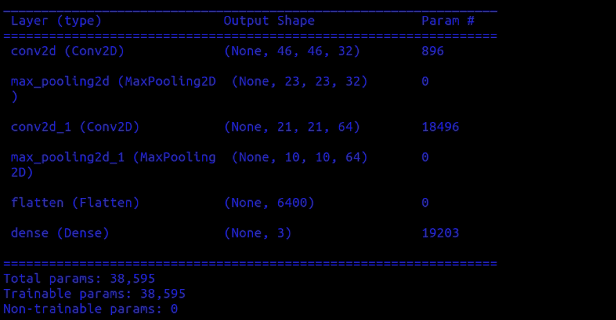

# Edge AI Project

## Overview
This project aims to demonstrate the implementation of Artificial Intelligence (AI) models on edge devices for real-time inference without the need for continuous internet connectivity. The project utilizes tensorflow python module to deploy and run AI models locally, enabling tasks such as image classification, without relying on cloud-based services.

## Features
- **Local Inference**: Perform AI inference directly on the edge device without internet dependency.
- **Low Latency**: Achieve real-time performance by processing data locally.
- **Privacy**: Ensure data privacy by processing sensitive information on-device without transmitting it over the internet.
- **Scalability**: Deploy multiple AI models tailored to specific use cases on the same edge device.

## Architecture: 


## Directories 
```
edge_ai_project/
│
├── model.py 
│      |
|      |
|      |── basic_model
|      |
|      ├── medium_model
|      |
|      ├── large_model
|
├── data/
│   ├── train/              
│   │   └── cls ...
│   └── validation/             
│       └── cls ....
│
│── ino_files/
│   ├── emoji_3_cls.ino/              
│   │   
│   └── emoji_cl_3.h/             
│      
│
├── README.md               # Project documentation
│
│
└── requirements.txt        # Python dependencies

```
## Installation
1. Clone this repository to your local machine.
``` bash
git clone https://github.com/shivaiisc/edge_ai_project.git
```
2. Navigate to the project directory.
``` 
cd edge_ai_project
``` 
3. Create conda envirenment 
```
conda create --name edge_ai python=3.11
```
4. Activate the environment
```
conda activate edge_ai_project
```
4. Install dependencies 
```
pip install -r requirements.txt
```
5. Train the model 
```
python train.py 
``` 

## Usage
1. After executing the above commands. emotion_classifier.h file will be downloaded in the current directory 
2. Copy past the header file into ino folder
3. Run the model 
4. Your Edge AI model is working 

## Models
- basic classifier model is light weight model. Can be deployed on any edge device 51 kB
- medium_classifier model is medium weight model. Can be deployed if you have space for medium model of size 112 kB.
- large_classifier model is large weight model. Can be deployed if you have space for large model of size 407 kB

## Model params: 

## Resources
- [Links to relevant documentation, tutorials, or research papers]
- [Any additional resources for further learning]

## Contributors
- Shiva Chandhra Developed tensorlow lite model collected data around 30 samples
- Ahatisham Ansari deployed on the Edge Device and collected data around 50 samples

## Acknowledgments
- Pandaraswamy Arjunan
